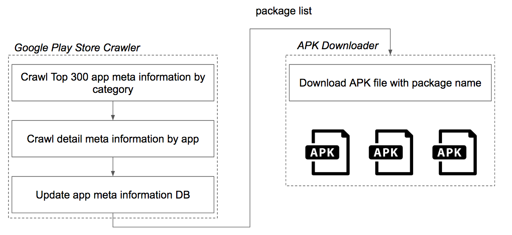

# APKCrawler
APK Crawler collects the APK files the exist in the Google Play store.
APK Crawler creates sqlite DB that contains meta data about top 300 apps by category.
APK Crawler downloads APK files at APKpure.com using collected meta data.

# Architecture

APK Crawler is consist of **Meta data Crawler**  and **APK Downloader**.
Play Store Crawler creates meta data DB.
APK Downloader downloads APK files that exist in meta data DB.

# Installation
```bash
sudo pip3 install -r requirements.txt
```
Xvfb(If you want run with no GUI mode)
```bash 
sudo apt-get install xvfb
```

# Dependancy
This project depands on python selenium library. So you need to install chrome, selenium chrome webdriver.
You can download selenium chrome webdriver in [here](https://sites.google.com/a/chromium.org/chromedriver/downloads).

# Usage
```bash
python3 main.py [-h] [--method METHOD] [--desktop DESKTOP]
```
-h, --help : show help message and exit

--method METHOD : function you want to run(crawl\_new, crawl\_old, update\_apk)

--desktop DESKTOP : true(desktop mode), false(server mode, no GUI window)


# DB Schema
| app_name | package | img_src | update_date | is_downloaded | category |
| --------|:-------:| ------:| ----------:| ------------:| --------:|
| Naver Dictionary & Translator | com.nhn.android | https://lh3.... | 2017년 4월 13일 | 1 | EDUCATION |
| 암기고래- 말해주는 단어장! | com.belugaedu... | https://lh3.... | 2017년 4월 17일 | 1 | EDUCATION|

